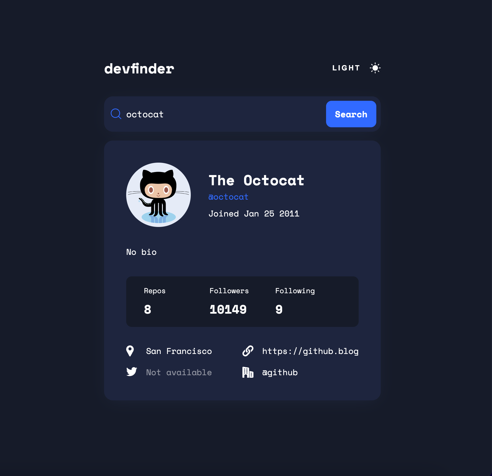

# Frontend Mentor - GitHub User Search App

### Description

This is a solution to the [GitHub user search app challenge on Frontend Mentor](https://www.frontendmentor.io/challenges/github-user-search-app-Q09YOgaH6).

### Features

- Search any GitHub user.
- Toggle between light and dark theme. Uses prefers-color-scheme to match users OS settings.
- Responsive design.

### Built With

- Semantic HTML5.
- CSS.
- Vanilla Javascript.
- BEM.

### Links

- GitHub URL: [https://github.com/norrland90/github-user-search-app]
- Live Site URL: [https://norrland90.github.io/github-user-search-app]

### Contact

Created by [@norrland90](https://github.com/norrland90) - feel free to contact me!
